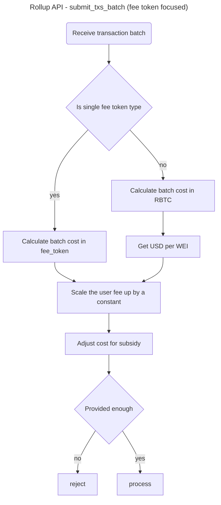

# **Tokens && Fees**

## **Table of content**

- [**Tokens \&\& Fees**](#tokens--fees)
  - [**Table of content**](#table-of-content)
  - [**Tokens**](#tokens)
    - [**Supported tokens**](#supported-tokens)
    - [**Listing a token**](#listing-a-token)
    - [**Tokens not available for fee payment**](#tokens-not-available-for-fee-payment)
  - [**Fees**](#fees)
    - [**Fee costs**](#fee-costs)
    - [**How fees are paid**](#how-fees-are-paid)
  - [**Transaction batching**](#transaction-batching)
    - [**_JS SDK side_**](#js-sdk-side)
    - [**_JS SDK side batch processing_**](#js-sdk-side-batch-processing)
      - [Single fee token type](#single-fee-token-type)
      - [Multiple fee token types](#multiple-fee-token-types)

## **Tokens**

RIF Rollup has a list of accepted tokens. A token is added to RIF Rollup via a transaction to its smart contract on L1.
The listed tokens are the only tokens available to transact or pay the fees on L2. Each token has an ID, the L1 native
token (RBTC) has the ID zero.

RIF Rollup requires fees for transactions to cover expenses for network operations and paying gas fees on L1. In
contrast to L1 transactions (though it can be achieved by using [RIF Relay](https://github.com/rsksmart/rif-relay)), L2
transactions can be paid using any listed token that is available to be used as a fee token. A fee token is a listed
token with a liquid market volume.

### **Supported tokens**

RIF Rollup can be used to transfer RBTC and ERC20 tokens. The full list of currently supported tokens is available under
this [link](https://explorer.rollup.rifcomputing.net) (opens new window). Locally, this can be seen in the
_localhost.json_ file under [etc/tokens](https://github.com/rsksmart/rif-rollup/tree/main/etc/tokens) folder and in the
_tokens_ database table.

Depending on the type of transaction, the submitter may or may not be able to select the type of token to pay the fees
with:

Operations where the user can select any of the listed tokens suitable for payment of fees (liquid market volume):

- ChangePubKey
- MintNFT
- WithdrawNFT
- Swap

Operations where the user must use the same token being operated as the fees token:

- Withdraw
- ForcedExit
- Transfer

> DISCLAIMER: Listing of a token on RIF Rollup does not represent an endorsement for this token by the RIF Rollup team,
> IOVLabs, or any other entity. We do not have competence and authority to analyze the token business model and smart
> contract security guarantees of a particular token. Please use any token on your own risk and judgement.

### **Listing a token**

1. Deploy your ERC20 contract and take note of its _address_.

   You can use `zk deploy-erc20 new <name> <symbol> <decimals> [<implementation>]`, for example:

   ```bash
   zk deploy-erc20 new "ProRif" "PRIF" 18 "$CUSTOM_ERC20_IMPL/abi.json"
   ```

   which will result in output:

   ```json
   {
     "address": "0x186E485150dDAB799Be8e25f87D717dEc45a86e5",
     "name": "ProRif",
     "symbol": "PRIF",
     "decimals": "18"
   }
   ```

2. In rollup run `zk run governance-add-erc20 new <address>`. this will:
   1. collect fees (token listing fees) on the `TokenGovernance` contract if caller is not on the `tokenLister` list and
      `listingFee > 0` (see [deployment](/docs/contract.md#deployment) and [Governance](/docs/contract.md#governance)
      for details)
   2. adds token to the `Governance` contract
   3. emits `NewToken` event
   4. The token symbol and decimals will be fetched from our internal token list based on data from CoinGecko. If your
      token is not on Coingecko, it will be listed as `ERC20-<Token ID>` with 18 decimals.
   5. the event is captured by the `eth_watch` module in `zksync_core` and token stored in the database using
      `token_handler` module

Operator could also chose to add some unconditionally valid tokens. These are the tokens that will be approved to be
used for fees regardless of their liquidity. By default only RBTC (which is treated as ERC20 in L2) is unconditionally
valid; unless in development, where also fake RIF and RDOC are deployed and added to the confguration. The configuration
for this is in `etc/env/<network>/fee_ticker.toml`, where `network` is either _testnet_, _mainnet_, or _dev_
(representing localhost).

```toml
unconditionally_valid_tokens="0x0000000000000000000000000000000000000000"
```

to add more make it into an array, e.g.:

```toml
unconditionally_valid_tokens=["0x0000000000000000000000000000000000000000","0x186E485150dDAB799Be8e25f87D717dEc45a86e5"]
```

### **Tokens not available for fee payment**

In some operations (Withdraw, ForcedExit, Transfer) the fee token cannot be selected and must be paid using the token
being transferred or withdrawn. However, if the transaction involves a token without a liquid market volume, then (as
per RIF Rollup documentation) fees for these operations are supposed to be paid using a different token but
unfortunately, this is currently not implemented.

Trying to transfer or withdraw a token that doesn’t have a liquid market volume will **fail**. There is a
[workaround](https://discord.com/channels/722409280497516566/829104124145696808/920231908460335114) though. To pay the
fee in a different token, you need to create a batch of transactions (there is a convenience class for it in the
[JS SDK](https://docs.zksync.io/api/sdk/js/accounts/#batch-builder)). The first transaction should be of the token you
wish to transfer/withdraw. Then since we’re assuming a scenario where no other tx needs to be sent, the user must
include a dummy transaction whose sole purpose is to pay for the fees. This second transaction may be of the same type
(i.e. transfer/withdraw) but for one of the available token fees. Since it’s a dummy transaction the user will set the
amount (transferred or withdrawn) as 0, and she must include a fee large enough (in this case approximately twice the
size) to cover the cost for both transactions. While this method works, the
[Transaction Batching](#transaction-batching) section presents a more user-friendly approach.

## **Fees**

Fees for each type of transaction are computed based on three main factors:

- Amount of data that will be sent to the L1 network.
- Current gas price on L1 (e.g. currently around 0.06 gwei on RSK).
- Cost of computational resources to generate a proof for a block including the transaction.

Fees are low since these fees are distributed among all the transactions included in the rollup block. The minimum fee
required to process a transaction can be queried using the `get_tx_fee` API entry
([v0.1](https://zksync.io/api/v0.1.html#get-tx-fee) or
[v0.2](https://docs.zksync.io/apiv02-docs/#fees-api-v0.2-fee-post))

### **Fee costs**

In RIF Rollup the cost of every transaction has two components:

- **Off-chain part (storage + prover costs):** the cost of the state storage and the SNARK (zero-knowledge proof)
  generation. This part depends on the use of hardware resources and is therefore invariable. Our benchmarks give
  estimates of
  [~0.001 USD](https://github.com/rsksmart/rif-rollup/blob/main/core/bin/zksync_api/src/fee_ticker/mod.rs#L269) per
  transfer.
- **On-chain part (gas costs):** for every RIF Rollup block the validator must pay gas to verify the SNARK proof, plus
  additional gas per transaction to publish the state 𝛥, depending on the transaction type. However, this part is orders
  of magnitude cheaper than the cost of normal RBTC/ERC20 transfers.

### **How fees are paid**

Transfers in RIF Rollup support "gasless meta-transactions": users pay transaction fees in the tokens being transferred.
Thus, for example, if you want to transfer RIFPro stable-coin, there is no need for you to own RBTC or any other tokens.
Just pay your fees in a fraction of RIFPro.

Tokens listed on Coingecko with $100 of total volume in usd (our current measure of liquidity) can be used to pay for
fees. For tokens without a liquid market volume, fees are paid in a different token.

This threshold can be also configured in `etc/env/<network>/fee_ticker.toml`, where `network` is either _testnet_,
_mainnet_, or _dev_ (representing localhost), under:

```toml
liquidity_volume=100
```

## **Transaction batching**

### **_JS SDK side_**

Transaction batching allows the user to submit several transactions at the same time, with the added benefit that the
collected fee may be calculated for the whole batch instead of per transaction.

This allows the user to include any transaction in the batch, whether it operates with a token that is eligible for fee
payment or not, since the batch builder allows the user to specify a fee token type that is independent of any of the
tokens used in the operations. The user includes several transactions in the batch, each of them with ‘0’ as fee, and
then selects a valid fee token when building the Batch transaction using the SDK, then the server will calculate the
total amount needed to be paid on that fee token.

For example, for two Transfer operations.

```javascript
const batch = await sender
  .batchBuilder()
  .addTransfer({ to: receiver.address(), tokenWithoutLiquidity1, amount })
  .addTransfer({ to: receiver.address(), tokenWithoutLiquidity2, amount })
  .build(tokenForFees);
```

By specifying the fee token (_tokenForFees_) during the Batch build process, it is expected for all the transactions
included to have the “fee amount” in 0, otherwise, the build process will fail. The build process will
[automatically calculate](https://github.com/rsksmart/rif-rollup/blob/main/sdk/zksync.js/src/batch-builder.ts#L110) the
cost for the whole batch, in the provided _tokenForFees_ token. For that it will first calculate the fee with the
[following formula](https://github.com/rsksmart/rif-rollup/blob/main/core/bin/zksync_api/src/fee_ticker/mod.rs#L408):

> $
> token\_risk\_factor = 1
> $
>
> $
> token\_price\_with\_risk\_in\_usd = token\_risk\_factor / token\_price\_in\_usd
> $
>
> $
> total\_zkp\_fee\_in\_tokens = cost\_per\_chunk\_in\_usd * total\_chunks * token\_price\_with\_risk\_in\_usd
> $
>
> $
> total\_gas\_fee\_in\_tokens = wei\_in\_usd * total\_gas * gas\_price\_in\_wei * scale\_factor * token\_price\_with\_risk\_in\_usd
> $
>
> $
> batch\_fee\_in\_tokens = total\_zkp\_fee\_in\_tokens + total\_gas\_fee\_in\_tokens
> $

- **scaleFactor** is a constant factor applied to the gasPrice to account for price volatility. feeTokenRiskFactor can
  be used to apply a correction factor that accounts for the risk of accepting the fee token as a method of payment.
  Currently, it is hardcoded to one but it may be used in future releases of RIF Rollup, or we may implement its use.

- **totalGas**: The batch gas cost is the sum of the calculated gas cost of all the included transactions. Each
  transaction type has a **_standard gas cost_**, consisting of the sum of the **_Verification cost_**, the **_Commit
  cost_**, and “processing” cost proportional to the transaction’s **_Chunk Size_**. All these values can be found
  [here](https://github.com/rsksmart/rif-rollup/blob/main/core/bin/zksync_api/src/fee_ticker/constants.rs). To this
  cost, a [scale factor](https://github.com/rsksmart/rif-rollup/blob/main/etc/env/base/fee_ticker.toml#L24) is applied
  (by default it is 100 which means no factor) if the transaction type is Transfer, Swap, MintNFT, or ChangePubKey. For
  fast Withdrawals (the ones that reduce the time-to-block-seal) there’s an extra step. Depending on the number of
  pending chunks in the current proposed (but pending) block, if there are enough chunks to fit the operation, the
  additional cost would be a proportional value given by the
  [AMORTIZED_COST_PER_CHUNK](https://github.com/rsksmart/rif-rollup/blob/main/core/bin/zksync_api/src/fee_ticker/constants.rs#L7)
  property.

- **zkpFee**: In addition to the total gas cost, there exists the total zkp generation cost, which is calculated as the
  cost per chunk (in Wei) multiplied by the total number of chunks in the batch.

The batch **build** process adds the _feeToken_ to be used to the last transaction of the batch if the transfer _token =
feeToken_. Otherwise it adds a new Transfer Transaction with **0** amount of _feeToken_ to be transfered.

During the **submission** of the Batch, the user will invoke
[`submitTxsBatch`](https://docs.zksync.io/api/sdk/js/providers/#submit-transactions-batch) which starts the
[submit_txs_batch](https://github.com/rsksmart/rif-rollup/blob/main/core/bin/zksync_api/src/api_server/tx_sender.rs#L633)
process on the server.

### **_JS SDK side batch processing_**

The server makes a distinction betwen batches that use:

- a single token type to pay fees with (_feeToken_) (has to be a single )
- multiple fee token types

#### Single fee token type

The process will
[calculate](https://github.com/rsksmart/rif-rollup/blob/main/core/bin/zksync_api/src/api_server/tx_sender.rs#L729) the
batch cost (standard operation type cost + zero-knowledge-proof cost per chunk (operation type)) with price per wei
provided by a fee ticker. The server then checks this value against the amount sent by the user. The submission will
fail if this value is higher than the user submitted fee (plus some
[constant upscaling](https://github.com/rsksmart/rif-rollup/blob/main/core/bin/zksync_api/src/api_server/tx_sender.rs#L749)
to compensate for price fluctuations).

#### Multiple fee token types

(each transaction in the batch defines the fee amount attribute instead of using the _tokenForFees_ parameter)

First, for each transaction it
[calculates](https://github.com/rsksmart/rif-rollup/blob/main/core/bin/zksync_api/src/api_server/tx_sender.rs#L707) the
amount paid in USD (it fetches the price in USD of the fee token used in that transaction) and then calculates the total
amount of USD paid for the batch
([_provided_total_usd_fee_](https://github.com/rsksmart/rif-rollup/blob/main/core/bin/zksync_api/src/api_server/tx_sender.rs#L718)).
Then it calculates the cost of the batch in the token0 (RBTC), and also fetches the token0 price in USD, these two
values are used to calculate the batch fee cost in USD
([_required_total_usd_fee_](https://github.com/rsksmart/rif-rollup/blob/main/core/bin/zksync_api/src/api_server/tx_sender.rs#L789)).
Finally, it checks that _provided_total_usd_fee_ (plus a constant upscaling the user’s paid fee to compensate for price
fluctuations) is greater or equal than _required_total_usd_fee_, otherwise, the submission fails. If in this scenario
transactions are operating in tokens that are not eligible as fee tokens, then their fee amount must be 0 (otherwise the
submission will fail). Since these are
[included](https://github.com/rsksmart/rif-rollup/blob/main/core/bin/zksync_api/src/api_server/tx_sender.rs#L685) in the
list of transactions when
[asking](https://github.com/rsksmart/rif-rollup/blob/main/core/bin/zksync_api/src/api_server/tx_sender.rs#L764) the
batch cost to the fee ticker, their cost is ultimately included in _required_total_usd_fee_, and the server will expect
that the total fee in USD paid for the whole batch is enough to cover the cost of these transactions with “unavailable
for fees” tokens.



Permissionless listings allow anybody to list new ERC20 tokens to be used in L2. However, only a whitelisted (by the
Operator) set of tokens can be used to pay fees. This matters because accepting arbitrary tokens for fees can be
logistically and economically challenging.
